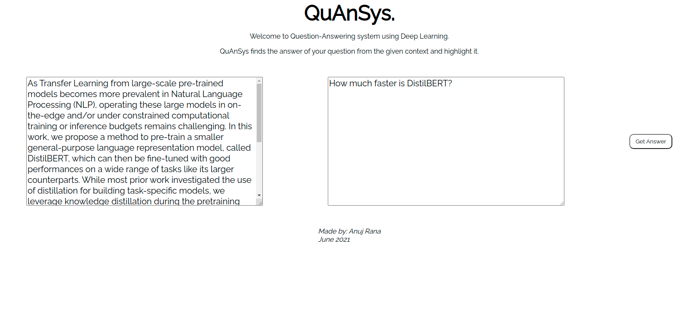
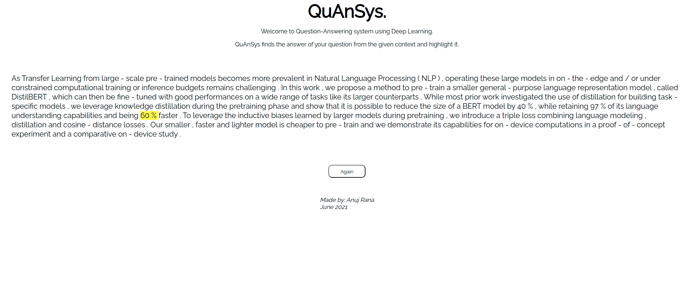

# QuAnSys (Question-Answering Sytem)

It uses DistilBERT huggingface pretrained model to extract answer of a question from a given context.

## Preview

### Page 1

### Page 2

- You can visit my project at: https://quansys.herokuapp.com